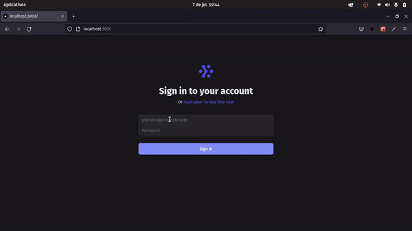

<h1 align="center">
    
</h1>

## 🏷️ Sobre 
**auth-system** é um sistema de autenticação, autorização e refresh token JWT, desenvolvido com um backend já pronto.

---

## 🛠️ Tecnologias e serviços utilizados
Foram utilizadas as seguintes tecnologias para desenvolver a aplicação **auth-system** :

- [Next.js](https://nextjs.org/)
- [Typescript](https://www.typescriptlang.org/)
- [TailwindCSS](https://tailwindcss.com/)
## OBS
backend separado construido em [Node.js](https://nodejs.org/en/)

---

## 🗂️ Como baixar e iniciar o projeto 

```bash

    #clonar o projeto
    $ git clone https://github.com/ElisioWander/auth-system.git

    #entrar no diretório
    $ cd auth-system

    #instalar as dependências
    $ yarn

    #iniciar a aplicação
    $ yarn dev
```
### Servidor local
localhost:3000

---

## ⚠️ ALERT ⚠️
Para a aplicação funcionar por inteiro, é necessário que se baixe o back-end do repositório [auth-system-backend](https://github.com/ElisioWander/auth-system-backend)

---

## 🗂️ Como baixar e iniciar o backend 

```bash

    #clonar o projeto
    $ git clone https://github.com/ElisioWander/auth-system-backend.git

    #entrar no diretório
    $ cd auth-system-backend

    #instalar as dependências
    $ yarn

    #iniciar a aplicação
    $ yarn dev
```
### Servidor local
localhost:3333

--- 
## SENHA E LOGIN
email: admin@test.com senha: 123456 (todas as permissões)
estagiario@test.com senha: 123456 (não tem todas as permissões)

---

## Autor
### 👤 Elisio Wander

- Linkedin: [@elisioWander](https://www.linkedin.com/in/elisio-wander-b88b69136/)
- github: [@elisioWander](https://github.com/ElisioWander)
- Site: [https://elisiowander.vercel.app](https://elisiowander.vercel.app)

---
## 📝 Licença
Copyright © 2020 [@ElisioWander](https://github.com/ElisioWander/auth-system/blob/main/LICENSE)

Este projeto está sobe a [LICENÇA MIT](https://opensource.org/licenses/MIT)

---

### Desenvolvido 💜 by Elisio Wander
